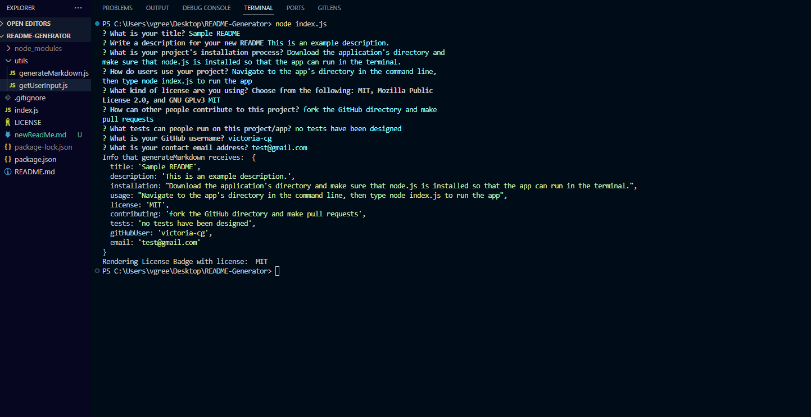

# README Generator

## Description
The purpose of this project was to design an app that can be executed in the command line using node.js and the inquirer package to create a new README markdown file. This project was completed at part of the UT/EdX Coding Bootcamp. The project allowed me to practice using node and inquirer package to create files and ask questions that collect user input. I also had the opportunity to practice use of template/string literals and the use of separate JS files/modules with the fs/filesystem package to create easy to read functions and import data from one function and module into another. 

## Table of Contents

- [Installation](#installation)
- [Usage](#usage)
- [Credits](#credits)
- [License](#license)

## Installation

Download the directory containing all files from the GitHub Repository. Install node.js if your computer does not already have it so that you can execute JS code in the command line.

## Usage

To use the README Generator app, navigate into the README-generator directory that you downloaded. Then from the command line, use the command 'node index.js' to run the application in the terminal. Follow the text prompts in the terminal by writing text answers according to the prompts an hitting 'enter' after every answer you give. Once all questions are answered a new markdown file will be generated with your answers populated into a README template. See the screenshot below for an example of how the questions and answers will look in the command line when interacting with the app. This is a link to a video example of how users interact with the application to generate a README file: 

    

## Credits

EdX Bootcamp tutor Alexis Gonzalez collaborated to suggest use of async/await in JS functions, suggested breaking JS functions into 2 separate JS files separated by function before importing data into index.js, and assisted with outlining the nested structure of passing data from getUserInput to generateMarkdown, and then to the main function in index.js.

Ask BCS tutor: assisted with debugging spacing on README template headers in generateMarkdown.js so that the markdown would read/format correctly

Resource for creating badges and formatting them to be compatible with markdown:
Shields.io. (2024). Static Badge. Shields.io. Retrieved February 25, 2024, from https://shields.io/badges/static-badge

Resource for README template formatting and usage:

EdX. (2023, November 14). Professional README Guide | The Full-Stack Blog. GitHub Pages. Retrieved February 25, 2024, from https://coding-boot-camp.github.io/full-stack/github/professional-readme-guide

Documentation for how to install and use the inquirer package:

NPM, Inc. (2022, April 28). inquirer - npm. inquirer - npm. Retrieved February 25, 2024, from https://www.npmjs.com/package/inquirer/v/8.2.4#examples

## License

This project uses an MIT license. Please refer to the license section of the repository or to the licence webiste for more information here: https://choosealicense.com/licenses/mit/.

